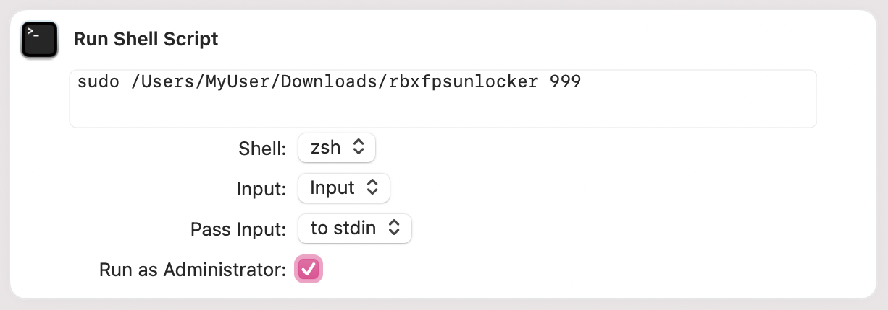

# rbxfpsunlocker-osx [](https://github.com/lanylow/rbxfpsunlocker-osx/blob/main/LICENSE) []() [](https://discord.gg/MrtJvV5tKv)

The first Roblox FPS unlocker for macOS. This has been tested and works both on Intel-based Macs and on M1 Macs using Rosetta 2.

## Setup

*Note: you must have `sudo` permissions in order to do the steps below. If you do not have `sudo` permissions, either change your account or add yourself to the sudoers file.*
1. Download the latest release from the [releases page](https://github.com/lanylow/rbxfpsunlocker-osx/releases).
2. Extract `rbxfpsunlocker.zip` by double clicking on it, if it wasn't extracted automatically.
3. Place `rbxfpsunlocker_osx` in any folder you want to keep it in.
4. Right-click on `rbxfpsunlocker_osx`, then hold the Option key, and finally click "Copy rbxfpsunlocker_osx as Pathname"
5. In a text editor, paste the text in, then add `sudo` before it. For example:
```
sudo /Users/MyUser/Downloads/rbxfpsunlocker_osx
```
6. Then add the FPS cap followed by a space after it. The cap is whatever framerate is desired, e.g. 90, 120, 144, etc. If the supplied framerate is 0, it will automatically be set to unlimited.
It should look like this with 144 FPS.
```
sudo /Users/MyUser/Downloads/rbxfpsunlocker_osx 144
```
If you want to unlock FPS in Roblox Studio, add `-s` at the end of the command. It should look like this.
```
sudo /Users/MyUser/Downloads/rbxfpsunlocker_osx 144 -s
```
This is the terminal command you will use to run `rbxfpsunlocker_osx`. **Note:** If you move `rbxfpsunlocker_osx` to another folder, you will need to change the path.

8. Open the Terminal App using one of two methods:
	* Press Command + Space, type in `Terminal`, then press enter on the Terminal app. 
	* Go to the Applications then into the Utilities folder. Open Terminal.
9. With a Roblox game open, copy and paste the command into Terminal. Enter the password used to log into your Mac in if it's asked for. *Please note that you will **NOT** see the password being typed but the text is still there.*
10. If the program returns an error saying `base_process constructor failed`, close Roblox and run the same command with `-r` at the end, for example.
```
sudo /Users/MyUser/Downloads/rbxfpsunlocker_osx 144 -r
```
If this command fails with `internal error in Code Signing subsystem`, go to `Privacy & Security > App Management` (on Ventura) or `Privacy & Security > Full Disk Access` (on older versions), and enable Terminal. Once this is done, try running the unlocker again, as explained in step 9.

*Note: you must run the command again if you leave a Roblox game and join a new one, and after launching Roblox for the first time after logging into macOS. Refer to the sections below to create either a terminal or app shortcut to make the process more convenient.*

### Creating a Terminal shortcut

In this section, you will create an alias, a terminal shortcut with a name and command. Entering the name into the terminal will run the command. 
1. In Finder, press Command + Shift + G and enter in `~` (copy and paste that in if necessary). It should say `Go to:` followed by the path to your user folder. Press enter or click on it. 
2. You will need to edit a hidden file. To show hidden files, press Command + Shift + . (period). Then locate the file `.zshrc`. This is the file where Terminal aliases are defined among other things.
3. Open `.zshrc` with a text editor, you may need to right-click then press `Open With > Other` and locate the editor you wish to use.
**If there's any text, don't remove it. Write below all the text in new lines.** Write a new line write an alias like this:
```
alias roblox='sudo /Users/MyUser/Downloads/rbxfpsunlocker_osx 144'
```
The name of the alias is `roblox` but you can name it whatever you want. Keep the exact format, the terminal command is in single quotation marks and there are no spaces next to `=`. You can create as many aliases as you want in separate lines for different framerates.
 
4. Open the Terminal app **(restart Terminal if it's running in order for the alias to apply)**. Enter in the name you chose for your alias and the command should run. In this case, writing `roblox` then hitting enter should run `rbxfpsunlocker_osx` with a cap of 144.

### Creating an App shortcut
In this section, you will create a shortcut using the built-in Shortcuts app. **The Shortcuts app is only available on macOS Monterey or newer.**

1. Open the Shortcuts app using one of two methods:
	* Press Command + Space, type in `Shortcuts`, then press enter on the Terminal app. 
	* Go to the Applications folder and open Shortcuts.
2. Create a new shortcut by pressing the + button in the title bar, then search for `Run Shell Script`. 
3. Paste the command in and check `Run as Administrator` (this is required for the command to run. It should look like this:



You can make as many shortcuts as you wish for different framerates. The shortcut can now be launched from either the Shortcuts app or you can create a shortcut to the Shortcut that can be opened from either the Dock or in Finder:

1. Right-click on the shortcut in the shortcuts menu, and press `Add to Dock`. If you wish to have it on the left side of the dock, then continue with the last two steps. 
2. Right-click on the shortcut in the Dock, and Click Options > Show in Finder.
3. You can now move the shortcut to any folder you want, or pin it to the dock.

## Compiling (advanced)

1. Open Terminal and clone the repository and change directory.

```
git clone https://github.com/lanylow/rbxfpsunlocker-osx/ && cd rbxfpsunlocker-osx
```

2. Compile. This will fail if you don't have [CMake](https://formulae.brew.sh/formula/cmake) installed.

```
bash build_release.sh
```

3. The binary will be placed in `cmake-build-release`. Go into it and launch the unlocker

```
cd cmake-build-release
sudo ./rbxfpsunlocker_osx <cap>
```

## Disclaimer

Please note that this is an FPS *unlocker* and not an FPS *booster* and if your frame rate is the same or below 60 FPS, then your machine is not powerful enough to run Roblox at more than 60 FPS. Heavy usage of system resources may occur because of the higher frame rate.

## Credits

 - @fjij - For bringing the idea to our attention
 - @lanylow - For reverse engineering and coding the unlocker
 - @SeizureSaladd - For testing the code for older versions

